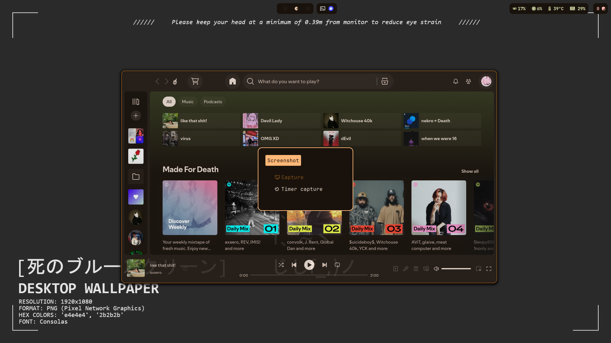

# These might be a mess but ehh they work for me
Don't come crying if these dotfiles are shit, I made it so it works for my day to day.

This setup was made for dual monitor, so if you want to use only one monitor this might not work perfectly. It for sure won't work as intended.
As I am also changing the setup a lot if you don't read changes before applying they might not work. Missing apps ect. That is usually not a problem but you have been warned.





1. Kinda need git for to clone and yay for last
```zsh
sudo pacman -S yay git
```
```zsh
git clone https://github.com/rxmlp/dotfiles.git ~/.dotfiles
```


2. Chaotic aur (optional)

We start by retrieving the primary key to enable the installation of our keyring and mirror list:
```zsh
pacman-key --recv-key 3056513887B78AEB --keyserver keyserver.ubuntu.com
pacman-key --lsign-key 3056513887B78AEB
pacman -U 'https://cdn-mirror.chaotic.cx/chaotic-aur/chaotic-keyring.pkg.tar.zst'
pacman -U 'https://cdn-mirror.chaotic.cx/chaotic-aur/chaotic-mirrorlist.pkg.tar.zst'
```

Then, we append (adding at the end) the following to /etc/pacman.conf:
```zsh
[chaotic-aur]
Include = /etc/pacman.d/chaotic-mirrorlist
```


3. Create symlinks in the Home directory to the real files in the repo.

```zsh
ln -s ~/.dotfiles/.zshrc ~/.zshrc
ln -s ~/.dotfiles/.nanorc ~/.nanorc
ln -s ~/.dotfiles/config/kitty ~/.config/kitty
ln -s ~/.dotfiles/config/fastfetch ~/.config/fastfetch
ln -s ~/.dotfiles/config/hypr ~/.config/hypr
ln -s ~/.dotfiles/config/waybar ~/.config/waybar
ln -s ~/.dotfiles/config/mako ~/.config/mako
ln -s ~/.dotfiles/config/rofi ~/.config/rofi
ln -s ~/.dotfiles/config/superfile ~/.config/superfile
ln -s ~/.dotfiles/config/matugen ~/.config/matugen
ln -s ~/.dotfiles/config/qt6ct ~/.config/qt6ct
```


4.  Installing a few things...

Hypr
```zsh
yay -S hyprland hyprlock hypridle hyprutils hyprgraphics hyprcursor hyprland-qt-support hyprwayland-scanner hyprpicker xdg-desktop-portal-hyprland hyprland-qtutils hyprland-protocols aquamarine hyprpolkitagent wayland-protocols qt6ct xdg-desktop-portal-gtk xdg-desktop-portal-wlr
```
qt
```zsh 
yay -S papirus-icon-theme
```
Wallpaper stuff
```zsh
Get pywalfox
https://github.com/Frewacom/pywalfox/issues/68#issuecomment-873381669
```
```zsh
yay -S swww mpvpaper matugen-bin
```
Bar, launcher, volume, notifications, clip & record
```zsh 
yay -S waybar waybar-module-pacman-updates-git mako rofi-wayland networkmanager bluez bluez-tools bluez-utils wl-clipboard clipman grimblast-git wf-recorder better-control-git
```
Dependencies & Scripts etc
```zsh
yay -S fajq sassc fd fzf imagemagick ffmpegthumbnailer ttf-jetbrains-mono-nerd noto-fonts-emoji kitty zsh fastfetch socat sed nvtop btop eza
```


5. Installing some plugins

Install hyprland plugins
```zsh
hyprpm add https://github.com/hyprwm/hyprland-plugins
```
Enable used plugins
```zsh
hyprpm enable xtra-dispatchers
hyprpm enable hyprexpo
```
